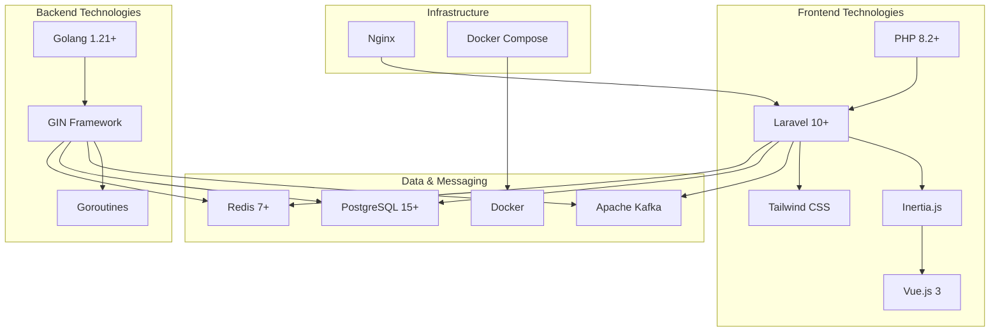
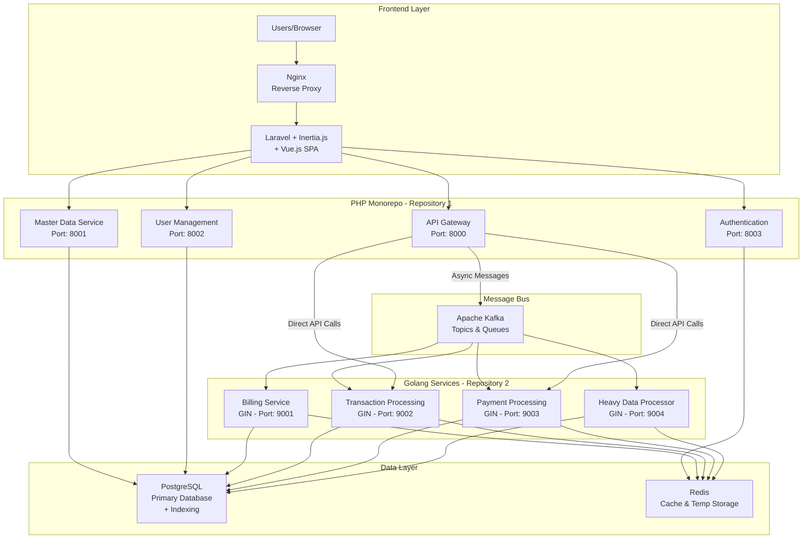
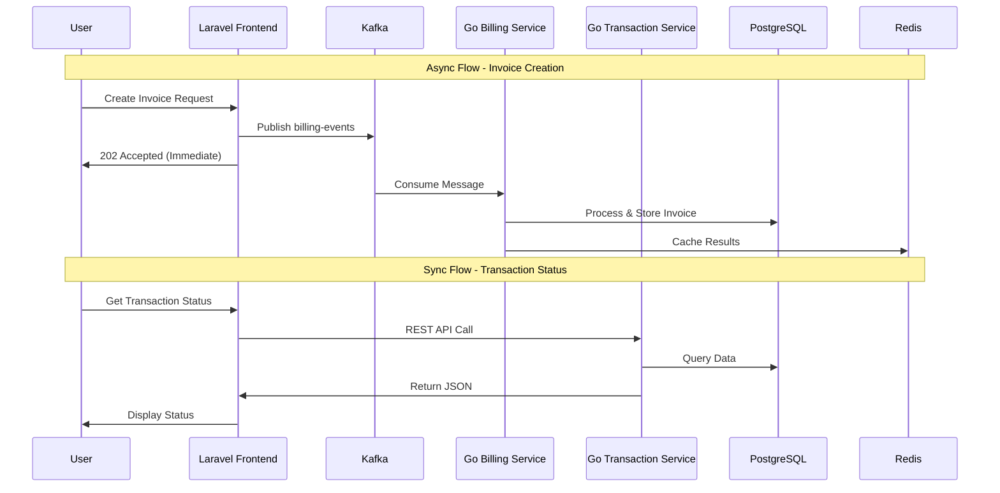
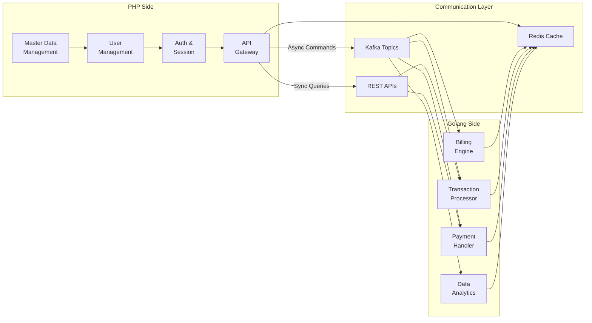
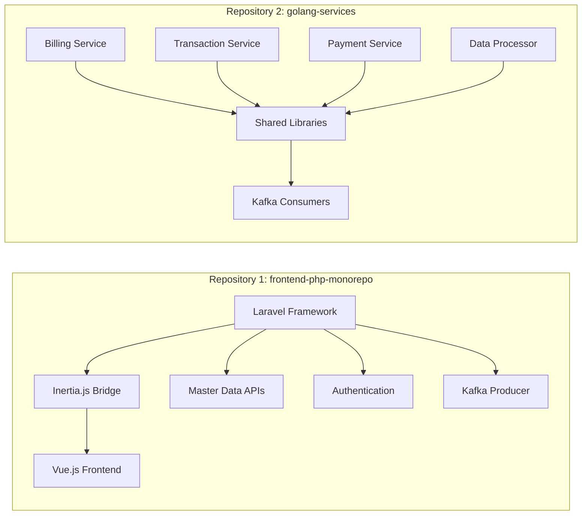

# Hybrid PHP & Golang Project Documentation
## Architecture Overview

### Stack Summary
- **Frontend Repository**: PHP + Laravel + Inertia.js + Vue.js framework
- **Backend Repository**: Golang + GIN framework for heavy processing
- **Database**: PostgreSQL with indexing optimization
- **Message Queue**: Apache Kafka for inter-service communication
- **Cache/Temp Storage**: Redis
- **Repository Structure**: 2 separate repositories

### Technology Stack Overview



---

## 🏗️ System Architecture Diagram

### High-Level Architecture Overview



### Communication Flow Diagram



### Data Flow Architecture



---

## 📁 Repository Structure

### Repository Overview



### Repository 1: PHP Frontend Monorepo (`frontend-php-monorepo`)

```
frontend-php-monorepo/
├── .env.example
├── .gitignore
├── composer.json
├── package.json
├── artisan
├── webpack.mix.js
├── docker-compose.yml
├── Dockerfile
├── app/
│   ├── Http/
│   │   ├── Controllers/
│   │   │   ├── API/
│   │   │   │   ├── MasterDataController.php
│   │   │   │   ├── UserController.php
│   │   │   │   └── AuthController.php
│   │   │   └── Web/
│   │   │       ├── DashboardController.php
│   │   │       ├── MasterDataController.php
│   │   │       └── UserController.php
│   │   ├── Middleware/
│   │   │   ├── KafkaMiddleware.php
│   │   │   └── RateLimitMiddleware.php
│   │   └── Requests/
│   ├── Models/
│   │   ├── User.php
│   │   ├── MasterData/
│   │   │   ├── Category.php
│   │   │   ├── Product.php
│   │   │   └── Configuration.php
│   │   └── BaseModel.php
│   ├── Services/
│   │   ├── KafkaService.php
│   │   ├── RedisService.php
│   │   └── GolangApiService.php
│   └── Jobs/
│       ├── SendToKafkaJob.php
│       └── ProcessDataJob.php
├── config/
│   ├── kafka.php
│   ├── redis.php
│   └── services.php
├── database/
│   ├── migrations/
│   ├── seeders/
│   └── factories/
├── resources/
│   ├── js/
│   │   ├── app.js
│   │   ├── Pages/
│   │   │   ├── Dashboard.vue
│   │   │   ├── MasterData/
│   │   │   │   ├── Index.vue
│   │   │   │   ├── Create.vue
│   │   │   │   └── Edit.vue
│   │   │   └── Users/
│   │   │       ├── Index.vue
│   │   │       ├── Profile.vue
│   │   │       └── Settings.vue
│   │   └── Components/
│   │       ├── Layout.vue
│   │       ├── Navigation.vue
│   │       └── DataTable.vue
│   └── views/
│       └── app.blade.php
├── routes/
│   ├── web.php
│   ├── api.php
│   └── kafka.php
└── tests/
    ├── Feature/
    └── Unit/
```

### Repository 2: Golang Services (`golang-services`)

```
golang-services/
├── .env.example
├── .gitignore
├── go.mod
├── go.sum
├── Dockerfile
├── docker-compose.yml
├── Makefile
├── cmd/
│   ├── billing/
│   │   └── main.go
│   ├── transaction/
│   │   └── main.go
│   ├── payment/
│   │   └── main.go
│   └── data-processor/
│       └── main.go
├── internal/
│   ├── billing/
│   │   ├── handler/
│   │   │   └── billing_handler.go
│   │   ├── service/
│   │   │   └── billing_service.go
│   │   ├── repository/
│   │   │   └── billing_repository.go
│   │   └── model/
│   │       └── billing.go
│   ├── transaction/
│   │   ├── handler/
│   │   ├── service/
│   │   ├── repository/
│   │   └── model/
│   ├── payment/
│   │   ├── handler/
│   │   ├── service/
│   │   ├── repository/
│   │   └── model/
│   └── shared/
│       ├── config/
│       │   └── config.go
│       ├── database/
│       │   └── postgres.go
│       ├── kafka/
│       │   ├── consumer.go
│       │   └── producer.go
│       ├── redis/
│       │   └── client.go
│       ├── middleware/
│       │   ├── auth.go
│       │   ├── cors.go
│       │   └── logging.go
│       └── utils/
│           ├── response.go
│           └── validator.go
├── pkg/
│   ├── logger/
│   ├── metrics/
│   └── errors/
├── configs/
│   ├── config.yaml
│   └── database.yaml
├── scripts/
│   ├── migration.sh
│   ├── seed.sh
│   └── deploy.sh
├── migrations/
│   ├── 001_create_billing_tables.up.sql
│   ├── 001_create_billing_tables.down.sql
│   ├── 002_create_transaction_tables.up.sql
│   └── 002_create_transaction_tables.down.sql
└── tests/
    ├── integration/
    └── unit/
```

---

## 💼 Service Details

### PHP Monorepo Services

#### 1. **Master Data Management Service** - Port 8001
**Purpose**: Handle low-traffic master data operations
**Tech Stack**: Laravel 10+ + Inertia.js + Vue 3

**Features**:
- Product categories management
- Configuration settings
- Reference data management
- CRUD operations with Vue.js interface
- Data validation and sanitization
- Export/Import functionality

**API Endpoints**:
```php
// routes/api.php
Route::prefix('api/v1/master-data')->group(function () {
    Route::get('/categories', [MasterDataController::class, 'categories']);
    Route::post('/categories', [MasterDataController::class, 'storeCategory']);
    Route::put('/categories/{id}', [MasterDataController::class, 'updateCategory']);
    Route::delete('/categories/{id}', [MasterDataController::class, 'deleteCategory']);
});
```

#### 2. **User Management Service** - Port 8002
**Purpose**: User account and profile management
**Tech Stack**: Laravel + Eloquent ORM + Vue 3

**Features**:
- User registration and authentication
- Profile management
- Role and permission management
- Account settings
- User activity tracking

#### 3. **Authentication & Authorization Service** - Port 8003
**Purpose**: Handle authentication and authorization
**Tech Stack**: Laravel Sanctum + JWT + Redis Session

**Features**:
- Login/logout functionality
- JWT token management
- Role-based access control (RBAC)
- Session management with Redis
- Password reset functionality

#### 4. **API Gateway** - Port 8000
**Purpose**: Route requests and manage communication
**Tech Stack**: Laravel + Kafka Client + Redis

**Features**:
- Request routing to appropriate services
- Rate limiting and throttling
- Kafka message publishing
- Response caching with Redis
- API versioning

### Golang Services (Heavy Processing)

#### 1. **Billing Service** - Port 9001
**Purpose**: Handle billing calculations and invoice generation
**Tech Stack**: GIN + PostgreSQL + Kafka Consumer + Redis

**Features**:
- Invoice generation
- Billing calculations
- Payment due tracking
- Recurring billing processing
- Tax calculations

**Sample Handler**:
```go
// internal/billing/handler/billing_handler.go
func (h *BillingHandler) GenerateInvoice(c *gin.Context) {
    // High-performance invoice generation
    // Concurrent processing for multiple line items
    // Background job for email delivery
}
```

#### 2. **Transaction Processing Service** - Port 9002
**Purpose**: Process high-volume financial transactions
**Tech Stack**: GIN + PostgreSQL + Kafka + Redis

**Features**:
- Real-time transaction processing
- Transaction validation
- Balance calculations
- Transaction history
- Concurrent processing with goroutines

#### 3. **Payment Processing Service** - Port 9003
**Purpose**: Handle payment gateway integrations
**Tech Stack**: GIN + Multiple Payment Gateways + PostgreSQL

**Features**:
- Multiple payment gateway integration
- Payment method management
- Refund processing
- Payment status tracking
- Webhook handling

#### 4. **Heavy Data Processor Service** - Port 9004
**Purpose**: Process large datasets and analytics
**Tech Stack**: GIN + PostgreSQL + ClickHouse + Kafka

**Features**:
- Batch data processing
- Real-time analytics
- Data aggregation
- Report generation
- Performance monitoring

---

## 🗄️ Database Design

### PostgreSQL Schema Design

#### Core Tables

```sql
-- Users table (PHP side)
CREATE TABLE users (
    id UUID PRIMARY KEY DEFAULT gen_random_uuid(),
    email VARCHAR(255) UNIQUE NOT NULL,
    password VARCHAR(255) NOT NULL,
    first_name VARCHAR(100) NOT NULL,
    last_name VARCHAR(100) NOT NULL,
    created_at TIMESTAMP DEFAULT CURRENT_TIMESTAMP,
    updated_at TIMESTAMP DEFAULT CURRENT_TIMESTAMP
);

-- Master data tables (PHP side)
CREATE TABLE categories (
    id UUID PRIMARY KEY DEFAULT gen_random_uuid(),
    name VARCHAR(255) NOT NULL,
    description TEXT,
    parent_id UUID REFERENCES categories(id),
    is_active BOOLEAN DEFAULT true,
    created_at TIMESTAMP DEFAULT CURRENT_TIMESTAMP,
    updated_at TIMESTAMP DEFAULT CURRENT_TIMESTAMP
);

-- Billing tables (Golang side)
CREATE TABLE billing_accounts (
    id UUID PRIMARY KEY DEFAULT gen_random_uuid(),
    user_id UUID NOT NULL,
    account_number VARCHAR(50) UNIQUE NOT NULL,
    balance DECIMAL(15,2) DEFAULT 0.00,
    currency VARCHAR(3) DEFAULT 'USD',
    status VARCHAR(20) DEFAULT 'active',
    created_at TIMESTAMP DEFAULT CURRENT_TIMESTAMP,
    updated_at TIMESTAMP DEFAULT CURRENT_TIMESTAMP
);

CREATE TABLE transactions (
    id UUID PRIMARY KEY DEFAULT gen_random_uuid(),
    account_id UUID REFERENCES billing_accounts(id),
    transaction_type VARCHAR(20) NOT NULL, -- 'debit', 'credit'
    amount DECIMAL(15,2) NOT NULL,
    description TEXT,
    reference_id VARCHAR(100),
    status VARCHAR(20) DEFAULT 'pending',
    processed_at TIMESTAMP,
    created_at TIMESTAMP DEFAULT CURRENT_TIMESTAMP
);

CREATE TABLE invoices (
    id UUID PRIMARY KEY DEFAULT gen_random_uuid(),
    account_id UUID REFERENCES billing_accounts(id),
    invoice_number VARCHAR(50) UNIQUE NOT NULL,
    total_amount DECIMAL(15,2) NOT NULL,
    tax_amount DECIMAL(15,2) DEFAULT 0.00,
    due_date DATE NOT NULL,
    status VARCHAR(20) DEFAULT 'pending',
    created_at TIMESTAMP DEFAULT CURRENT_TIMESTAMP,
    updated_at TIMESTAMP DEFAULT CURRENT_TIMESTAMP
);
```

#### Indexing Strategy

```sql
-- Performance indexes for PHP services
CREATE INDEX idx_users_email ON users(email);
CREATE INDEX idx_categories_parent ON categories(parent_id);
CREATE INDEX idx_categories_active ON categories(is_active);

-- Performance indexes for Golang services
CREATE INDEX idx_billing_accounts_user ON billing_accounts(user_id);
CREATE INDEX idx_transactions_account ON transactions(account_id);
CREATE INDEX idx_transactions_created ON transactions(created_at);
CREATE INDEX idx_transactions_status ON transactions(status);
CREATE INDEX idx_invoices_account ON invoices(account_id);
CREATE INDEX idx_invoices_status ON invoices(status);
CREATE INDEX idx_invoices_due_date ON invoices(due_date);

-- Composite indexes for complex queries
CREATE INDEX idx_transactions_account_status_date ON transactions(account_id, status, created_at);
CREATE INDEX idx_invoices_account_status_due ON invoices(account_id, status, due_date);
```

---

## 🔄 Communication Architecture

### Kafka Configuration

#### Topics Design

```yaml
# kafka-topics.yaml
topics:
  - name: user-events
    partitions: 6
    replication-factor: 3
    config:
      cleanup.policy: delete
      retention.ms: 604800000  # 7 days
    
  - name: billing-events
    partitions: 12
    replication-factor: 3
    config:
      cleanup.policy: delete
      retention.ms: 2592000000  # 30 days
    
  - name: transaction-events
    partitions: 12
    replication-factor: 3
    config:
      cleanup.policy: delete
      retention.ms: 7776000000  # 90 days
    
  - name: payment-events
    partitions: 6
    replication-factor: 3
    config:
      cleanup.policy: delete
      retention.ms: 2592000000  # 30 days
```

#### PHP Kafka Producer

```php
// app/Services/KafkaService.php
<?php

namespace App\Services;

use RdKafka\Producer;
use RdKafka\ProducerTopic;

class KafkaService
{
    private Producer $producer;
    
    public function __construct()
    {
        $conf = new \RdKafka\Conf();
        $conf->set('bootstrap.servers', config('kafka.brokers'));
        $conf->set('compression.type', 'snappy');
        $this->producer = new Producer($conf);
    }
    
    public function publishEvent(string $topic, array $data, string $key = null): bool
    {
        $topic = $this->producer->newTopic($topic);
        
        $payload = json_encode([
            'event_id' => \Str::uuid(),
            'timestamp' => now()->toISOString(),
            'source' => 'php-frontend',
            'data' => $data
        ]);
        
        $topic->produce(RD_KAFKA_PARTITION_UA, 0, $payload, $key);
        
        return $this->producer->flush(10000) === RD_KAFKA_RESP_ERR_NO_ERROR;
    }
}
```

#### Golang Kafka Consumer

```go
// internal/shared/kafka/consumer.go
package kafka

import (
    "encoding/json"
    "log"
    "github.com/Shopify/sarama"
)

type Consumer struct {
    consumer sarama.ConsumerGroup
    topics   []string
}

type EventHandler interface {
    HandleEvent(topic string, message *sarama.ConsumerMessage) error
}

func NewConsumer(brokers []string, groupID string, topics []string) (*Consumer, error) {
    config := sarama.NewConfig()
    config.Consumer.Group.Rebalance.Strategy = sarama.BalanceStrategyRoundRobin
    config.Consumer.Offsets.Initial = sarama.OffsetNewest
    
    consumer, err := sarama.NewConsumerGroup(brokers, groupID, config)
    if err != nil {
        return nil, err
    }
    
    return &Consumer{
        consumer: consumer,
        topics:   topics,
    }, nil
}

func (c *Consumer) Start(handler EventHandler) {
    for {
        if err := c.consumer.Consume(context.Background(), c.topics, &ConsumerGroupHandler{
            handler: handler,
        }); err != nil {
            log.Printf("Error consuming: %v", err)
        }
    }
}
```

---

## 🔧 Redis Configuration

### Redis Usage Patterns

#### PHP Redis Usage

```php
// config/redis.php
return [
    'default' => [
        'url' => env('REDIS_URL'),
        'host' => env('REDIS_HOST', '127.0.0.1'),
        'password' => env('REDIS_PASSWORD'),
        'port' => env('REDIS_PORT', '6379'),
        'database' => env('REDIS_DB', '0'),
    ],
    
    'cache' => [
        'host' => env('REDIS_HOST', '127.0.0.1'),
        'password' => env('REDIS_PASSWORD'),
        'port' => env('REDIS_PORT', '6379'),
        'database' => env('REDIS_CACHE_DB', '1'),
    ],
    
    'session' => [
        'host' => env('REDIS_HOST', '127.0.0.1'),
        'password' => env('REDIS_PASSWORD'),
        'port' => env('REDIS_PORT', '6379'),
        'database' => env('REDIS_SESSION_DB', '2'),
    ],
];

// app/Services/RedisService.php
<?php

namespace App\Services;

use Illuminate\Support\Facades\Redis;

class RedisService
{
    public function cacheUserData(int $userId, array $data, int $ttl = 3600): bool
    {
        $key = "user:{$userId}:data";
        return Redis::setex($key, $ttl, json_encode($data));
    }
    
    public function getUserData(int $userId): ?array
    {
        $key = "user:{$userId}:data";
        $data = Redis::get($key);
        return $data ? json_decode($data, true) : null;
    }
    
    public function invalidateUserCache(int $userId): bool
    {
        $key = "user:{$userId}:data";
        return Redis::del($key) > 0;
    }
}
```

#### Golang Redis Usage

```go
// internal/shared/redis/client.go
package redis

import (
    "context"
    "encoding/json"
    "time"
    "github.com/go-redis/redis/v8"
)

type Client struct {
    rdb *redis.Client
}

func NewClient(addr, password string, db int) *Client {
    rdb := redis.NewClient(&redis.Options{
        Addr:     addr,
        Password: password,
        DB:       db,
    })
    
    return &Client{rdb: rdb}
}

func (c *Client) Set(ctx context.Context, key string, value interface{}, expiration time.Duration) error {
    data, err := json.Marshal(value)
    if err != nil {
        return err
    }
    
    return c.rdb.Set(ctx, key, data, expiration).Err()
}

func (c *Client) Get(ctx context.Context, key string, dest interface{}) error {
    val, err := c.rdb.Get(ctx, key).Result()
    if err != nil {
        return err
    }
    
    return json.Unmarshal([]byte(val), dest)
}

// Temporary storage for billing calculations
func (c *Client) StoreBillingTemp(ctx context.Context, invoiceID string, data map[string]interface{}) error {
    key := fmt.Sprintf("billing:temp:%s", invoiceID)
    return c.Set(ctx, key, data, time.Hour*24) // 24 hour expiration
}
```

---

## 🚀 Deployment Architecture

### Docker Configuration

#### PHP Frontend Docker

```dockerfile
# frontend-php-monorepo/Dockerfile
FROM php:8.2-fpm-alpine

# Install system dependencies
RUN apk add --no-cache \
    nginx \
    nodejs \
    npm \
    postgresql-dev \
    librdkafka-dev \
    autoconf \
    gcc \
    g++ \
    make

# Install PHP extensions
RUN docker-php-ext-install pdo pdo_pgsql

# Install Kafka extension
RUN pecl install rdkafka && docker-php-ext-enable rdkafka

# Install Redis extension
RUN pecl install redis && docker-php-ext-enable redis

# Install Composer
COPY --from=composer:latest /usr/bin/composer /usr/bin/composer

WORKDIR /var/www/html

# Copy application files
COPY . .

# Install dependencies
RUN composer install --no-dev --optimize-autoloader
RUN npm install && npm run production

# Set permissions
RUN chown -R www-data:www-data /var/www/html/storage /var/www/html/bootstrap/cache

EXPOSE 8000

CMD ["php-fpm"]
```

#### Golang Services Docker

```dockerfile
# golang-services/Dockerfile
FROM golang:1.21-alpine AS builder

WORKDIR /app

# Install dependencies
RUN apk add --no-cache git

# Copy go mod files
COPY go.mod go.sum ./
RUN go mod download

# Copy source code
COPY . .

# Build services
RUN CGO_ENABLED=0 GOOS=linux go build -o billing ./cmd/billing
RUN CGO_ENABLED=0 GOOS=linux go build -o transaction ./cmd/transaction
RUN CGO_ENABLED=0 GOOS=linux go build -o payment ./cmd/payment
RUN CGO_ENABLED=0 GOOS=linux go build -o data-processor ./cmd/data-processor

# Final stage
FROM alpine:latest

RUN apk --no-cache add ca-certificates
WORKDIR /root/

# Copy binaries from builder
COPY --from=builder /app/billing .
COPY --from=builder /app/transaction .
COPY --from=builder /app/payment .
COPY --from=builder /app/data-processor .

# Copy configuration
COPY --from=builder /app/configs ./configs

EXPOSE 9001 9002 9003 9004

# Default command (can be overridden)
CMD ["./billing"]
```

### Docker Compose

```yaml
# docker-compose.yml (root level)
version: '3.8'

services:
  # Database
  postgres:
    image: postgres:15-alpine
    environment:
      POSTGRES_DB: hybrid_app
      POSTGRES_USER: postgres
      POSTGRES_PASSWORD: password
    ports:
      - "5432:5432"
    volumes:
      - postgres_data:/var/lib/postgresql/data
      - ./init.sql:/docker-entrypoint-initdb.d/init.sql

  # Redis
  redis:
    image: redis:7-alpine
    ports:
      - "6379:6379"
    volumes:
      - redis_data:/data

  # Kafka & Zookeeper
  zookeeper:
    image: confluentinc/cp-zookeeper:latest
    environment:
      ZOOKEEPER_CLIENT_PORT: 2181
      ZOOKEEPER_TICK_TIME: 2000

  kafka:
    image: confluentinc/cp-kafka:latest
    depends_on:
      - zookeeper
    ports:
      - "9092:9092"
    environment:
      KAFKA_BROKER_ID: 1
      KAFKA_ZOOKEEPER_CONNECT: zookeeper:2181
      KAFKA_ADVERTISED_LISTENERS: PLAINTEXT://localhost:9092
      KAFKA_OFFSETS_TOPIC_REPLICATION_FACTOR: 1

  # PHP Frontend
  php-frontend:
    build: ./frontend-php-monorepo
    ports:
      - "8000:8000"
      - "8001:8001"
      - "8002:8002"
      - "8003:8003"
    depends_on:
      - postgres
      - redis
      - kafka
    environment:
      DB_HOST: postgres
      REDIS_HOST: redis
      KAFKA_BROKERS: kafka:9092

  # Golang Services
  golang-billing:
    build: ./golang-services
    command: ./billing
    ports:
      - "9001:9001"
    depends_on:
      - postgres
      - redis
      - kafka
    environment:
      DB_HOST: postgres
      REDIS_HOST: redis
      KAFKA_BROKERS: kafka:9092

  golang-transaction:
    build: ./golang-services
    command: ./transaction
    ports:
      - "9002:9002"
    depends_on:
      - postgres
      - redis
      - kafka
    environment:
      DB_HOST: postgres
      REDIS_HOST: redis
      KAFKA_BROKERS: kafka:9092

  golang-payment:
    build: ./golang-services
    command: ./payment
    ports:
      - "9003:9003"
    depends_on:
      - postgres
      - redis
      - kafka
    environment:
      DB_HOST: postgres
      REDIS_HOST: redis
      KAFKA_BROKERS: kafka:9092

  golang-data-processor:
    build: ./golang-services
    command: ./data-processor
    ports:
      - "9004:9004"
    depends_on:
      - postgres
      - redis
      - kafka
    environment:
      DB_HOST: postgres
      REDIS_HOST: redis
      KAFKA_BROKERS: kafka:9092

volumes:
  postgres_data:
  redis_data:
```

---

## 🔧 Configuration Files

### PHP Environment Configuration

```env
# frontend-php-monorepo/.env
APP_NAME="Hybrid PHP Frontend"
APP_ENV=production
APP_KEY=base64:your-app-key-here
APP_DEBUG=false
APP_URL=http://localhost:8000

# Database
DB_CONNECTION=pgsql
DB_HOST=postgres
DB_PORT=5432
DB_DATABASE=hybrid_app
DB_USERNAME=postgres
DB_PASSWORD=password

# Redis
REDIS_HOST=redis
REDIS_PASSWORD=null
REDIS_PORT=6379
REDIS_DB=0
REDIS_CACHE_DB=1
REDIS_SESSION_DB=2

# Kafka
KAFKA_BROKERS=kafka:9092
KAFKA_GROUP_ID=php-frontend-group

# Services
GOLANG_BILLING_URL=http://golang-billing:9001
GOLANG_TRANSACTION_URL=http://golang-transaction:9002
GOLANG_PAYMENT_URL=http://golang-payment:9003
GOLANG_DATA_PROCESSOR_URL=http://golang-data-processor:9004

# Session
SESSION_DRIVER=redis
SESSION_LIFETIME=120

# Cache
CACHE_DRIVER=redis

# Queue
QUEUE_CONNECTION=redis
```

### Golang Configuration

```yaml
# golang-services/configs/config.yaml
server:
  host: "0.0.0.0"
  read_timeout: 10s
  write_timeout: 10s
  idle_timeout: 60s

database:
  host: "postgres"
  port: 5432
  user: "postgres"
  password: "password"
  dbname: "hybrid_app"
  sslmode: "disable"
  max_open_conns: 25
  max_idle_conns: 25
  max_lifetime: 5m

redis:
  host: "redis"
  port: 6379
  password: ""
  db: 3
  pool_size: 10
  min_idle_conns: 5

kafka:
  brokers:
    - "kafka:9092"
  consumer:
    group_id: "golang-services"
    auto_offset_reset: "earliest"
  producer:
    compression: "snappy"
    batch_size: 16384
    linger_ms: 5

logging:
  level: "info"
  format: "json"
  output: "stdout"

services:
  billing:
    port: 9001
  transaction:
    port: 9002
  payment:
    port: 9003
  data_processor:
    port: 9004
```

## 🔒 Security Considerations

### Authentication & Authorization

#### JWT Token Management

```php
// app/Services/JWTService.php
<?php

namespace App\Services;

use Firebase\JWT\JWT;
use Firebase\JWT\Key;

class JWTService
{
    private string $secret;
    private string $algorithm = 'HS256';
    
    public function __construct()
    {
        $this->secret = config('app.jwt_secret');
    }
    
    public function generateToken(array $payload): string
    {
        $payload['iat'] = time();
        $payload['exp'] = time() + (60 * 60 * 24); // 24 hours
        
        return JWT::encode($payload, $this->secret, $this->algorithm);
    }
    
    public function validateToken(string $token): array
    {
        return (array) JWT::decode($token, new Key($this->secret, $this->algorithm));
    }
}
```

#### Golang JWT Middleware

```go
// internal/shared/middleware/auth.go
package middleware

import (
    "net/http"
    "strings"
    "github.com/gin-gonic/gin"
    "github.com/golang-jwt/jwt/v4"
)

func AuthMiddleware(secretKey string) gin.HandlerFunc {
    return func(c *gin.Context) {
        authHeader := c.GetHeader("Authorization")
        if authHeader == "" {
            c.JSON(http.StatusUnauthorized, gin.H{"error": "Authorization header required"})
            c.Abort()
            return
        }
        
        bearerToken := strings.Split(authHeader, " ")
        if len(bearerToken) != 2 || bearerToken[0] != "Bearer" {
            c.JSON(http.StatusUnauthorized, gin.H{"error": "Invalid authorization header"})
            c.Abort()
            return
        }
        
        token, err := jwt.Parse(bearerToken[1], func(token *jwt.Token) (interface{}, error) {
            return []byte(secretKey), nil
        })
        
        if err != nil || !token.Valid {
            c.JSON(http.StatusUnauthorized, gin.H{"error": "Invalid token"})
            c.Abort()
            return
        }
        
        claims, ok := token.Claims.(jwt.MapClaims)
        if !ok {
            c.JSON(http.StatusUnauthorized, gin.H{"error": "Invalid token claims"})
            c.Abort()
            return
        }
        
        c.Set("user_id", claims["user_id"])
        c.Next()
    }
}
```

---

## 📊 Performance Optimization

### Database Optimization

#### Connection Pooling

```go
// internal/shared/database/postgres.go
package database

import (
    "database/sql"
    "time"
    _ "github.com/lib/pq"
)

func NewPostgresConnection(dsn string) (*sql.DB, error) {
    db, err := sql.Open("postgres", dsn)
    if err != nil {
        return nil, err
    }
    
    // Connection pool configuration
    db.SetMaxOpenConns(25)
    db.SetMaxIdleConns(25)
    db.SetConnMaxLifetime(5 * time.Minute)
    db.SetConnMaxIdleTime(1 * time.Minute)
    
    return db, nil
}
```

#### Query Optimization

```sql
-- Example optimized query for transaction processing
EXPLAIN ANALYZE
SELECT 
    t.id,
    t.amount,
    t.status,
    ba.account_number,
    u.email
FROM transactions t
INNER JOIN billing_accounts ba ON t.account_id = ba.id
INNER JOIN users u ON ba.user_id = u.id
WHERE t.created_at >= $1 
    AND t.status = $2
    AND ba.status = 'active'
ORDER BY t.created_at DESC
LIMIT 100;

-- Supporting indexes
CREATE INDEX CONCURRENTLY IF NOT EXISTS idx_transactions_optimized 
ON transactions(created_at DESC, status) 
WHERE status IN ('pending', 'processing', 'completed');
```

### Caching Strategy

#### PHP Laravel Caching

```php
// app/Services/CacheService.php
<?php

namespace App\Services;

use Illuminate\Support\Facades\Cache;

class CacheService
{
    private const CACHE_TTL = [
        'user_data' => 3600,      // 1 hour
        'master_data' => 86400,   // 24 hours
        'categories' => 43200,    // 12 hours
    ];
    
    public function getUserData(int $userId): ?array
    {
        return Cache::remember(
            "user:{$userId}:data",
            self::CACHE_TTL['user_data'],
            fn() => User::with(['profile', 'settings'])->find($userId)?->toArray()
        );
    }
    
    public function invalidateUserData(int $userId): void
    {
        Cache::forget("user:{$userId}:data");
    }
    
    public function getCategories(): array
    {
        return Cache::remember(
            'categories:active',
            self::CACHE_TTL['categories'],
            fn() => Category::where('is_active', true)->get()->toArray()
        );
    }
}
```

#### Golang Redis Caching

```go
// internal/shared/cache/cache.go
package cache

import (
    "context"
    "encoding/json"
    "time"
    "github.com/go-redis/redis/v8"
)

type Cache struct {
    client *redis.Client
}

func NewCache(redisURL string) *Cache {
    opt, _ := redis.ParseURL(redisURL)
    return &Cache{
        client: redis.NewClient(opt),
    }
}

func (c *Cache) Set(ctx context.Context, key string, value interface{}, ttl time.Duration) error {
    data, err := json.Marshal(value)
    if err != nil {
        return err
    }
    return c.client.Set(ctx, key, data, ttl).Err()
}

func (c *Cache) Get(ctx context.Context, key string, dest interface{}) error {
    val, err := c.client.Get(ctx, key).Result()
    if err != nil {
        return err
    }
    return json.Unmarshal([]byte(val), dest)
}

// Cache with callback for cache miss
func (c *Cache) Remember(ctx context.Context, key string, ttl time.Duration, fn func() (interface{}, error)) (interface{}, error) {
    var result interface{}
    err := c.Get(ctx, key, &result)
    
    if err == redis.Nil {
        // Cache miss, call function
        result, err = fn()
        if err != nil {
            return nil, err
        }
        
        // Store in cache
        _ = c.Set(ctx, key, result, ttl)
        return result, nil
    }
    
    return result, err
}
```

---

## 🚀 Getting Started Guide

### Prerequisites

1. **System Requirements**
   - Docker & Docker Compose
   - PHP 8.2+
   - Go 1.21+
   - PostgreSQL 15+
   - Redis 7+
   - Apache Kafka

2. **Development Tools**
   - VS Code or PHPStorm
   - Postman or Insomnia
   - pgAdmin or DBeaver
   - Redis CLI

This comprehensive documentation provides everything needed to implement your hybrid PHP & Golang project with the specified architecture and requirements.
