# Writeen App - Phase 1 Development Milestone

## 🚀 Global High-Level Flow

### Development Philosophy
**Single Full-Stack Developer** → **1 Month Timeline** → **Realistic MVP** → **Core Features Only**

### High-Level Architecture Flow

#### Interactive System Architecture (Mermaid)

```mermaid
graph TD
    A[📱 Flutter App] --> B[🔐 Authentication]
    A --> C[�� Home Screen]
    A --> D[📅 Schedule]
    A --> E[💬 Chat]
    A --> F[📁 Documents]
    A --> G[�� Profile]
    
    B --> H[🌐 Golang + Gin API]
    C --> H
    D --> H
    E --> H
    F --> H
    G --> H
    
    H --> I[🔑 JWT Middleware]
    H --> J[📊 MongoDB Database]
    H --> K[📁 File Storage]
    H --> L[🔄 WebSocket Server]
    
    J --> M[(👥 Users)]
    J --> N[(📋 Bookings)]
    J --> O[(💬 Messages)]
    J --> P[(📄 Documents)]
    
    style A fill:#e1f5fe
    style H fill:#f3e5f5
    style J fill:#e8f5e8
    style L fill:#fff3e0
```


#### System Overview
```
┌─────────────────────────────────────────────────────────────────┐
│                    🎓 WRITEEN ACADEMIC PLATFORM                  │
└─────────────────────────────────────────────────────────────────┘

📱 MOBILE APP (Flutter + Dart)
┌─────────────────┐    ┌─────────────────┐    ┌─────────────────┐
│   🏠 Home       │    │   📅 Schedule   │    │   💬 Chat       │
│   • Greetings   │    │   • Calendar    │    │   • Real-time   │
│   • Quick Stats │    │   • Booking     │    │   • Messages    │
│   • Navigation  │    │   • Management  │    │   • History     │
└─────────────────┘    └─────────────────┘    └─────────────────┘
┌─────────────────┐    ┌─────────────────┐
│   📁 Documents  │    │   👤 Profile    │
│   • Upload      │    │   • Settings    │
│   • View Files  │    │   • Academic    │
│   • Sharing     │    │   • Management  │
└─────────────────┘    └─────────────────┘
            │                              │
            └──────────────┬───────────────┘
                          │
                    📡 HTTP/WebSocket
                          │
┌─────────────────────────────────────────────────────────────────┐
│                    🔧 BACKEND API (Golang + Gin)                │
├─────────────────────────────────────────────────────────────────┤
│  🔐 Auth        📋 Booking      �� Chat        📁 Files        │
│  • JWT          • CRUD API      • WebSocket    • Upload        │
│  • Register     • Time Slots    • Real-time    • Download      │
│  • Login        • Validation    • Status       • Metadata     │
│  • Middleware   • History       • Threading    • Sharing      │
└─────────────────────────────────────────────────────────────────┘
                          │
                    🔌 MongoDB Driver
                          │
┌─────────────────────────────────────────────────────────────────┐
│                    ��️ DATABASE (MongoDB)                        │
├─────────────────────────────────────────────────────────────────┤
│  👥 Users       📋 Bookings     �� Messages    📄 Documents    │
│  • Profiles     • Schedules     • Chats        • Metadata      │
│  • Roles        • Status        • Threading    • Storage       │
│  • Settings     • History       • Real-time    • Sharing       │
└─────────────────────────────────────────────────────────────────┘
```

### 3-Day Prototype Delivery Plan
**Days 1-3: First Working UI Prototype**
- Day 1: Setup Flutter project + Basic navigation
- Day 2: Create all 5 screens with mock data
- Day 3: Polish UI + Demo preparation

## 🎯 Phase 1 Overview

**Objective**: Deliver a simplified, functional MVP of the Writeen academic thesis guidance platform within 1 month.

**Scope**: Core functionality enabling students to book consultations with tutors, basic communication, and document sharing.

**Target Users**: Students and Tutors with essential features only.

**Developer**: Single full-stack developer (realistic timeline and scope)

---

## 📋 Phase 1 Feature Scope (Simplified)

### ✅ Already Completed
- [x] App structure with GetX state management
- [x] Navigation system (5 main screens)
- [x] Academic design system and UI components
- [x] Home screen with dynamic greetings
- [x] Schedule screen with calendar functionality
- [x] Basic chat interface
- [x] Document list interface
- [x] Profile management screen
- [x] APK build configuration

### �� Phase 1 Target Features (Realistic MVP)

#### Core Features (Must Have - Simplified)
1. **Basic Authentication**
   - Simple registration/login
   - JWT token storage
   - User roles (Student/Tutor)

2. **Simple Booking System**
   - View tutor list
   - Book time slots
   - View bookings

3. **Basic Communication**
   - Send/receive text messages
   - Simple chat interface

4. **Simple Document Upload**
   - Upload files
   - View file list
   - Basic sharing

5. **User Profiles**
   - Basic profile info
   - Simple editing

#### Removed Complex Features
- ~~Real-time notifications~~
- ~~Advanced search~~
- ~~File download with preview~~
- ~~Consultation status tracking~~
- ~~Rating and review system~~
- ~~Advanced calendar features~~
- ~~Complex availability management~~

---

## 📅 Realistic 1-Month Timeline

### Days 1-3: UI Prototype (First Deliverable)

#### Day 1: Project Setup
- [ ] Initialize Flutter project structure
- [ ] Set up GetX state management
- [ ] Create basic navigation between screens
- [ ] Set up academic color theme

#### Day 2: Core UI Screens
- [ ] Create Home screen with mock data
- [ ] Build Schedule screen with basic calendar
- [ ] Design Chat interface
- [ ] Create Documents list view
- [ ] Build Profile screen

#### Day 3: UI Polish & Demo
- [ ] Polish all screen designs
- [ ] Add loading states and transitions
- [ ] Test navigation flow
- [ ] Prepare demo presentation
- [ ] **DELIVERABLE: Working UI Prototype**

---

### Days 4-10: Backend Foundation (Week 1)

#### Day 4-5: Golang Backend Setup
- [ ] Initialize Go project with Gin
- [ ] Set up basic project structure
- [ ] Create simple MongoDB connection
- [ ] Set up CORS and basic middleware

#### Day 6-7: Authentication API
- [ ] Create user registration endpoint
- [ ] Implement login with JWT
- [ ] Set up password hashing
- [ ] Create basic profile endpoints

#### Day 8-9: Database Models
- [ ] Create User model and operations
- [ ] Set up Booking model
- [ ] Create Message model
- [ ] Design simple document model

#### Day 10: Flutter-Backend Integration
- [ ] Connect Flutter to backend API
- [ ] Test authentication flow
- [ ] Verify profile operations
- [ ] **DELIVERABLE: Working Authentication**

---

### Days 11-17: Core Features (Week 2)

#### Day 11-12: Tutor Management
- [ ] Create tutor listing API
- [ ] Simple tutor profile display
- [ ] Basic availability system
- [ ] Connect to Flutter UI

#### Day 13-14: Booking System
- [ ] Create booking CRUD API
- [ ] Simple time slot booking
- [ ] Basic booking validation
- [ ] Connect to calendar UI

#### Day 15-16: Basic Chat
- [ ] Simple message API
- [ ] Basic chat interface
- [ ] Message history
- [ ] Connect to Flutter chat

#### Day 17: Integration Testing
- [ ] Test all API endpoints
- [ ] Verify Flutter integration
- [ ] Fix critical bugs
- [ ] **DELIVERABLE: Core Features Working**

---

### Days 18-24: Communication & Files (Week 3)

#### Day 18-19: Real-time Chat
- [ ] Implement simple WebSocket
- [ ] Real-time message sync
- [ ] Basic message status
- [ ] Connect to Flutter

#### Day 20-21: File Upload
- [ ] Simple file upload API
- [ ] Basic file storage
- [ ] File listing
- [ ] Connect to Flutter

#### Day 22-23: Feature Polish
- [ ] Improve error handling
- [ ] Add loading states
- [ ] Basic validation
- [ ] UI improvements

#### Day 24: Testing & Fixes
- [ ] Test all features end-to-end
- [ ] Fix critical issues
- [ ] Performance optimization
- [ ] **DELIVERABLE: Complete MVP**

---

### Days 25-30: Final Polish & Deployment (Week 4)

#### Day 25-26: Final UI Polish
- [ ] Consistent styling
- [ ] Better error messages
- [ ] Smooth animations
- [ ] Mobile optimization

#### Day 27-28: Testing & Bug Fixes
- [ ] Complete app testing
- [ ] Fix all critical bugs
- [ ] Performance optimization
- [ ] User experience improvements

#### Day 29: Deployment Preparation
- [ ] Build production APK
- [ ] Prepare documentation
- [ ] Create user guide
- [ ] Final quality check

#### Day 30: Launch
- [ ] Deploy backend server
- [ ] Release APK
- [ ] Document completion
- [ ] **DELIVERABLE: Production-Ready MVP**

---

## 🛠️ Simplified Technical Stack

### Frontend (Flutter)
- **Framework**: Flutter with Dart
- **State Management**: GetX (simple)
- **UI**: Material Design + Academic Theme
- **HTTP Client**: Dio
- **WebSocket**: web_socket_channel

### Backend (Golang)
- **Framework**: Gin (lightweight)
- **Database**: MongoDB (local)
- **Authentication**: JWT tokens
- **File Storage**: Simple local storage
- **WebSocket**: gorilla/websocket

### Database (MongoDB)
- **Collections**: Users, Bookings, Messages, Documents
- **Hosting**: Local MongoDB instance
- **Schema**: Simple, no complex relationships

---

## 🎯 Realistic Success Criteria

### Technical Success
- [ ] Flutter app builds and runs
- [ ] Golang API responds to requests
- [ ] MongoDB stores and retrieves data
- [ ] Authentication works with JWT
- [ ] Basic file upload works
- [ ] Simple chat messaging works

### User Experience Success
- [ ] Students can register and login
- [ ] Students can view and book tutors
- [ ] Basic messaging between users
- [ ] File upload and viewing
- [ ] Profile management works

### Business Success
- [ ] MVP demonstrates core concept
- [ ] All essential user flows work
- [ ] App is stable for demo
- [ ] Ready for user feedback
- [ ] Foundation for future features

---

## 📊 Risk Mitigation (Realistic)

### Simplified Approach
1. **Use Local MongoDB** - No cloud setup complexity
2. **Simple File Storage** - No GridFS, just local files
3. **Basic WebSocket** - Simple message sync, no complex features
4. **Minimal Authentication** - JWT only, no OAuth
5. **Focus on Core Flow** - Registration → Booking → Chat → File Upload

---

## 🎉 Success Definition

**Phase 1 MVP is successful when:**
- Student can register → find tutor → book appointment → chat → upload file
- Tutor can register → set availability → accept booking → chat → view files
- All basic flows work without crashes
- App is ready for user testing and feedback

**Ready for Phase 2 when:**
- MVP is stable and tested
- User feedback collected
- Performance is acceptable
- Architecture supports future features

---

*This milestone represents a realistic 1-month development plan for a single full-stack developer, focusing on core MVP features that provide immediate value while building a solid foundation for future enhancements.*
