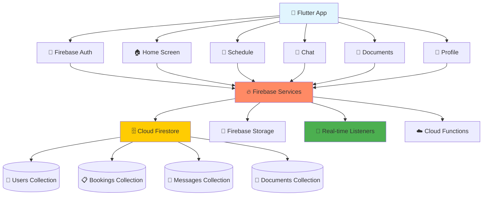

# Writeen App - Phase 1 Development Milestone (Firebase Version)

## 🚀 Global High-Level Flow

### Development Philosophy
**Single Full-Stack Developer** → **3 Weeks Timeline** → **Realistic MVP** → **Core Features Only**

### High-Level Architecture Flow

#### Interactive System Architecture (Mermaid)


#### System Overview
```
┌─────────────────────────────────────────────────────────────────┐
│                    🎓 WRITEEN ACADEMIC PLATFORM                  │
│                        (Firebase Version)                       │
└─────────────────────────────────────────────────────────────────┘

📱 MOBILE APP (Flutter + Dart)
┌─────────────────┐    ┌─────────────────┐    ┌─────────────────┐
│   🏠 Home       │    │   📅 Schedule   │    │   💬 Chat       │
│   • Greetings   │    │   • Calendar    │    │   • Real-time   │
│   • Quick Stats │    │   • Booking     │    │   • Messages    │
│   • Navigation  │    │   • Management  │    │   • History     │
└─────────────────┘    └─────────────────┘    └─────────────────┘
┌─────────────────┐    ┌─────────────────┐
│   📁 Documents  │    │   👤 Profile    │
│   • Upload      │    │   • Settings    │
│   • View Files  │    │   • Academic    │
│   • Sharing     │    │   • Management  │
└─────────────────┘    └─────────────────┘
            │                              │
            └──────────────┬───────────────┘
                          │
                    📡 Firebase SDK
                          │
┌─────────────────────────────────────────────────────────────────┐
│                    🔥 FIREBASE SERVICES                          │
├─────────────────────────────────────────────────────────────────┤
│  🔐 Auth        📋 Firestore     💬 Real-time   📁 Storage     │
│  • Email Auth   • NoSQL DB       • Listeners    • File Upload  │
│  • User Mgmt    • Collections    • Live Sync    • Download     │
│  • Security     • Queries        • Presence     • Security     │
│  • Rules        • Indexes        • Offline      • Rules        │
└─────────────────────────────────────────────────────────────────┘
                          │
                    ☁️ Google Cloud
                          │
┌─────────────────────────────────────────────────────────────────┐
│                    🗄️ CLOUD FIRESTORE                           │
├─────────────────────────────────────────────────────────────────┤
│  👥 users       📋 bookings     💬 messages    📄 documents    │
│  • profiles     • schedules     • chats        • metadata      │
│  • roles        • status        • real-time    • files         │
│  • settings     • history       • threading    • sharing       │
└─────────────────────────────────────────────────────────────────┘
```

### 3-Day Prototype Delivery Plan
**Days 1-3: First Working UI Prototype**
- Day 1: Setup Flutter + Firebase project + Basic navigation
- Day 2: Create all 5 screens with Firebase integration
- Day 3: Polish UI + Real-time features demo

## 🎯 Phase 1 Overview

**Objective**: Deliver a simplified, functional MVP of the Writeen academic thesis guidance platform within 3 weeks.

**Scope**: Core functionality enabling students to book consultations with tutors, real-time communication, and document sharing.

**Target Users**: Students and Tutors with essential features only.

**Developer**: Single full-stack developer (accelerated Firebase timeline)

---

## 📋 Phase 1 Feature Scope (Firebase Powered)

### ✅ Already Completed
- [x] App structure with GetX state management
- [x] Navigation system (5 main screens)
- [x] Academic design system and UI components
- [x] Home screen with dynamic greetings
- [x] Schedule screen with calendar functionality
- [x] Basic chat interface
- [x] Document list interface
- [x] Profile management screen
- [x] APK build configuration

### 🎯 Phase 1 Target Features (Firebase MVP)

#### Core Features (Must Have - Firebase Enhanced)
1. **Firebase Authentication**
   - Email/password registration
   - Google Sign-in
   - User profiles with Firestore
   - Role-based access (Student/Tutor)

2. **Real-time Booking System**
   - Firestore tutor listings
   - Real-time availability
   - Instant booking updates
   - Calendar integration

3. **Real-time Communication**
   - Firestore real-time chat
   - Message status indicators
   - Typing indicators
   - Offline message sync

4. **Cloud Document Management**
   - Firebase Storage upload
   - Secure file sharing
   - Real-time metadata sync
   - Access control

5. **Dynamic User Profiles**
   - Firestore user data
   - Real-time updates
   - Image upload to Storage
   - Academic information

#### Firebase Advantages
- ✅ Real-time data synchronization
- ✅ Offline functionality
- ✅ Automatic scaling
- ✅ Built-in security rules
- ✅ No server management
- ✅ Push notifications ready

---

## 📅 Accelerated 3-Week Timeline

### Days 1-3: Firebase Setup & UI (First Deliverable)

#### Day 1: Firebase Project Setup
- [ ] Create Firebase project
- [ ] Configure Firebase for Flutter
- [ ] Set up Authentication
- [ ] Initialize Firestore database
- [ ] Configure Firebase Storage

#### Day 2: Core UI with Firebase
- [ ] Connect authentication to UI
- [ ] Create real-time Home screen
- [ ] Build Schedule with Firestore data
- [ ] Design Chat with real-time listeners
- [ ] Create Documents with Storage integration

#### Day 3: Real-time Features Demo
- [ ] Implement real-time chat
- [ ] Add live booking updates
- [ ] Test offline functionality
- [ ] **DELIVERABLE: Working Firebase Prototype**

---

### Days 4-10: Authentication & User Management (Week 1)

#### Day 4-5: Complete Authentication
- [ ] Email/password authentication
- [ ] Google Sign-in integration
- [ ] User profile creation
- [ ] Role-based user types
- [ ] Security rules setup

#### Day 6-7: User Profiles & Data
- [ ] Firestore user data models
- [ ] Profile image upload to Storage
- [ ] Real-time profile updates
- [ ] Academic information management
- [ ] User preferences

#### Day 8-9: Security & Rules
- [ ] Firestore security rules
- [ ] Storage security rules
- [ ] User data validation
- [ ] Role-based access control
- [ ] Data privacy compliance

#### Day 10: Integration Testing
- [ ] Test all authentication flows
- [ ] Verify real-time updates
- [ ] Test offline functionality
- [ ] **DELIVERABLE: Complete User System**

---

### Days 11-17: Core Features & Real-time (Week 2)

#### Day 11-12: Tutor Management
- [ ] Firestore tutor collections
- [ ] Real-time tutor listings
- [ ] Availability management
- [ ] Search and filtering
- [ ] Rating and reviews

#### Day 13-14: Booking System
- [ ] Real-time booking creation
- [ ] Calendar integration
- [ ] Booking status updates
- [ ] Notification triggers
- [ ] Booking history

#### Day 15-16: Real-time Chat
- [ ] Firestore chat collections
- [ ] Real-time message listeners
- [ ] Message status tracking
- [ ] Typing indicators
- [ ] Chat history and search

#### Day 17: Feature Integration
- [ ] Test all real-time features
- [ ] Verify cross-platform sync
- [ ] Performance optimization
- [ ] **DELIVERABLE: Core Features Complete**

---

### Days 18-21: Polish & Deployment (Week 3)

#### Day 18: Document Management
- [ ] Firebase Storage integration
- [ ] File upload with progress
- [ ] Document sharing system
- [ ] Metadata management
- [ ] Access control

#### Day 19: Final Polish
- [ ] UI/UX improvements
- [ ] Error handling
- [ ] Loading states
- [ ] Animations and transitions
- [ ] Responsive design

#### Day 20: Testing & Optimization
- [ ] End-to-end testing
- [ ] Performance optimization
- [ ] Security validation
- [ ] Offline functionality test
- [ ] Cross-device testing

#### Day 21: Deployment
- [ ] Build production APK
- [ ] Firebase hosting setup
- [ ] Analytics configuration
- [ ] **DELIVERABLE: Production-Ready MVP**

---

## 🛠️ Firebase Technical Stack

### Frontend (Flutter)
- **Framework**: Flutter with Dart
- **State Management**: GetX + Firebase listeners
- **UI**: Material Design + Academic Theme
- **Firebase SDK**: firebase_core, firebase_auth, cloud_firestore

### Backend (Firebase)
- **Authentication**: Firebase Auth
- **Database**: Cloud Firestore
- **Storage**: Firebase Storage
- **Functions**: Cloud Functions (if needed)
- **Hosting**: Firebase Hosting

### Key Firebase Dependencies
```yaml
dependencies:
  firebase_core: ^2.24.2
  firebase_auth: ^4.15.3
  cloud_firestore: ^4.13.6
  firebase_storage: ^11.5.6
  firebase_analytics: ^10.7.4
  firebase_messaging: ^14.7.10
```

---

## 🎯 Firebase Success Criteria

### Technical Success
- [ ] Firebase project configured
- [ ] Real-time data synchronization working
- [ ] Authentication flows complete
- [ ] File upload/download functional
- [ ] Offline functionality tested
- [ ] Security rules implemented

### User Experience Success
- [ ] Instant real-time updates
- [ ] Seamless offline/online transition
- [ ] Fast authentication
- [ ] Smooth file operations
- [ ] Cross-device synchronization

### Business Success
- [ ] Rapid MVP development
- [ ] Scalable infrastructure
- [ ] Real-time collaboration
- [ ] Professional user experience
- [ ] Ready for user testing

---

## 📊 Firebase Advantages

### Development Speed
1. **No Backend Development** - Focus 100% on Flutter
2. **Real-time Out of Box** - No WebSocket implementation
3. **Authentication Built-in** - No JWT or session management
4. **File Storage Ready** - No server file handling
5. **Instant Deployment** - No server setup or maintenance

### Features Included
- ✅ Real-time data synchronization
- ✅ Offline functionality
- ✅ Push notifications
- ✅ Analytics
- ✅ Crash reporting
- ✅ Performance monitoring

---

## 🎉 Firebase Success Definition

**Phase 1 MVP is successful when:**
- Student can register → find tutor → book appointment → chat in real-time → upload files
- Tutor can register → set availability → accept bookings → chat instantly → manage files
- All features work offline and sync when online
- Real-time updates work across all devices
- App is production-ready with Firebase scaling

**Ready for Phase 2 when:**
- Firebase MVP is stable and tested
- Real-time features performing well
- User feedback collected
- Analytics data available
- Scale-ready infrastructure proven

---

*This milestone represents an accelerated 3-week development plan using Firebase, focusing on real-time MVP features that provide immediate value with minimal backend complexity.*
