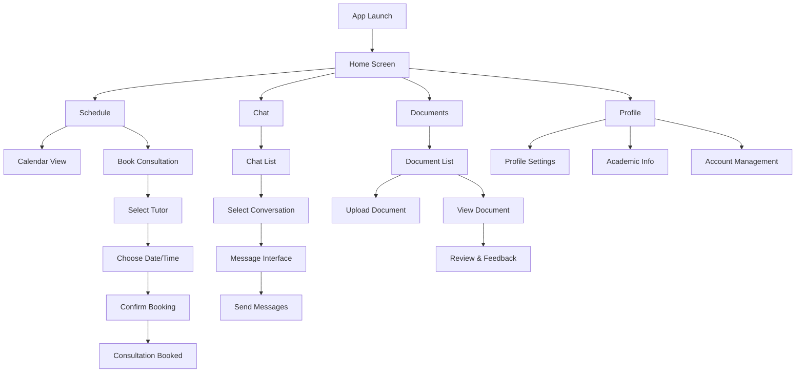
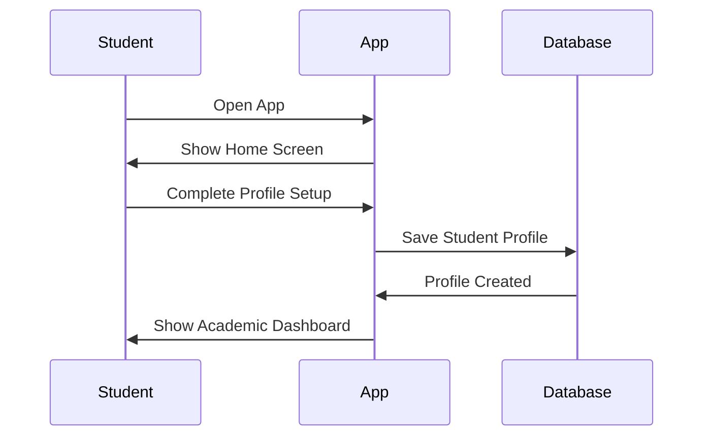
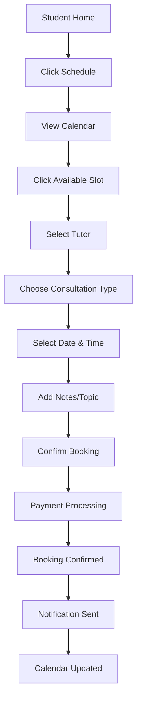
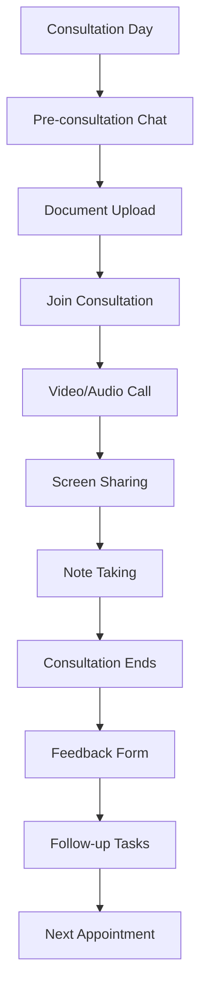
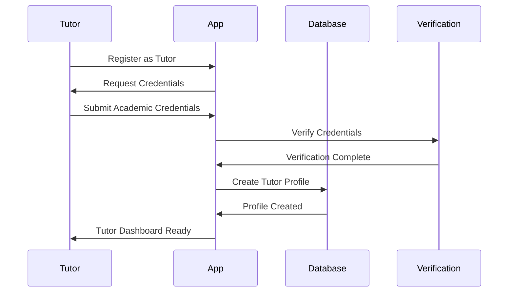
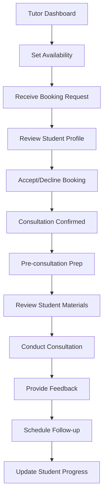
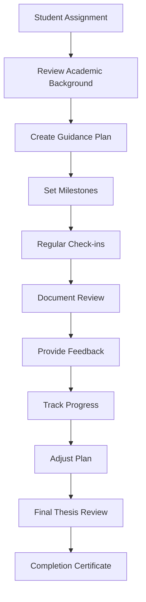
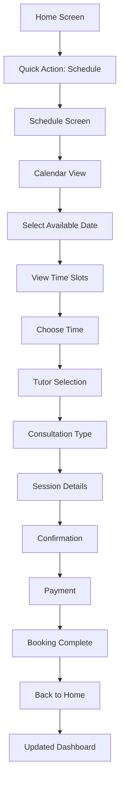
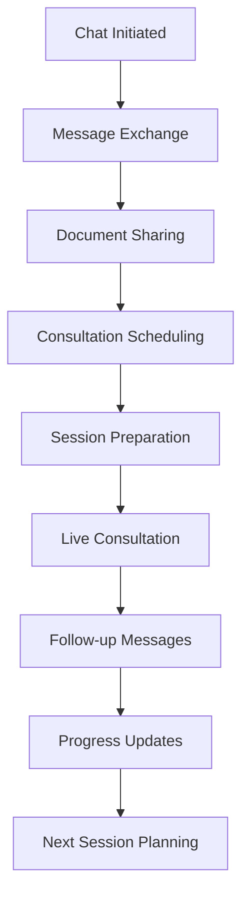
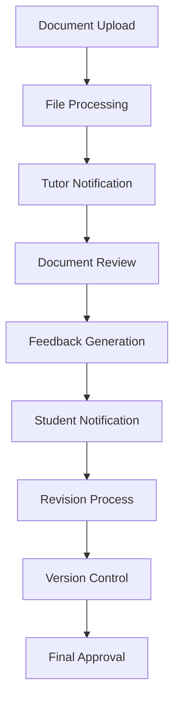

# Writeen App Requirements & User Flows

## Overview
Writeen is an academic thesis guidance platform that connects students with tutors for comprehensive thesis support. This document outlines the complete user flows and feature requirements for both students and tutors.

## User Types & Roles

### 👨‍🎓 Students
Primary users seeking thesis guidance and academic support

### 👩‍🏫 Tutors
Academic professionals providing thesis guidance and consultation services

---

## 1. Complete Application Flow

### Main Application Flow

---

## 2. Student Complete Journey

### A. Student Registration & Setup Flow

### B. Student Booking Flow

### C. Student Consultation Flow

### Student Features & Workflow

#### 🎯 Student Core Features:
1. **Profile Management**
   - Academic information setup
   - Thesis topic and progress
   - University details
   - Contact information

2. **Tutor Discovery & Booking**
   - Browse available tutors
   - View tutor specializations
   - Check availability calendar
   - Book consultation sessions

3. **Consultation Management**
   - Schedule management
   - Pre-consultation preparation
   - Document sharing
   - Session notes and recordings

4. **Communication**
   - Direct messaging with tutors
   - Group discussions
   - Academic announcements
   - Progress updates

5. **Document Management**
   - Upload thesis chapters
   - Share research materials
   - Receive feedback
   - Version control

#### 📋 Student Complete Flow:

**Phase 1: Onboarding (A → B → C)**
- A: Download and install app
- B: Create student profile
- C: Complete academic information setup

**Phase 2: Tutor Selection (D → E → F)**
- D: Browse available tutors
- E: Review tutor profiles and specializations
- F: Select preferred tutor

**Phase 3: Booking Process (G → H → I)**
- G: Check tutor availability
- H: Schedule consultation appointment
- I: Confirm booking and payment

**Phase 4: Pre-Consultation (J → K → L)**
- J: Prepare materials and questions
- K: Upload relevant documents
- L: Communicate with tutor via chat

**Phase 5: Consultation Session (M → N → O)**
- M: Join scheduled consultation
- N: Participate in guidance session
- O: Take notes and receive feedback

**Phase 6: Post-Consultation (P → Q → R)**
- P: Review session notes
- Q: Implement feedback
- R: Schedule follow-up if needed

**Phase 7: Ongoing Support (S → T → U)**
- S: Continue document revisions
- T: Regular check-ins with tutor
- U: Progress toward thesis completion

---

## 3. Tutor Complete Journey

### A. Tutor Registration & Setup Flow

### B. Tutor Consultation Management Flow

### C. Tutor Student Management Flow

### Tutor Features & Workflow

#### 🎓 Tutor Core Features:
1. **Professional Profile**
   - Academic credentials
   - Specialization areas
   - Experience and achievements
   - Student reviews and ratings

2. **Availability Management**
   - Set consultation hours
   - Manage calendar
   - Block unavailable times
   - Recurring schedule setup

3. **Student Management**
   - View assigned students
   - Track student progress
   - Manage consultation history
   - Academic performance monitoring

4. **Consultation Tools**
   - Video conferencing
   - Screen sharing
   - Document annotation
   - Session recording

5. **Communication Hub**
   - Direct messaging with students
   - Group discussions
   - Academic announcements
   - Progress reports

#### 📋 Tutor Complete Flow:

**Phase A: Professional Setup (A → B → C)**
- A: Register as tutor with credentials
- B: Complete academic profile
- C: Set specialization areas

**Phase B: Availability Configuration (D → E → F)**
- D: Set weekly availability schedule
- E: Configure consultation pricing
- F: Enable booking notifications

**Phase C: Student Engagement (G → H → I)**
- G: Receive booking requests
- H: Review student profiles
- I: Accept suitable consultations

**Phase D: Consultation Preparation (J → K → L)**
- J: Review student materials
- K: Prepare guidance agenda
- L: Set consultation objectives

**Phase E: Active Consultation (M → N → O)**
- M: Conduct guidance session
- N: Provide academic feedback
- O: Assign follow-up tasks

**Phase F: Progress Monitoring (P → Q → R)**
- P: Track student development
- Q: Adjust guidance approach
- R: Celebrate milestones

**Phase G: Completion Support (S → T → U)**
- S: Final thesis review
- T: Defense preparation
- U: Academic achievement recognition

---

## 4. Feature Integration Flow

### Home to Schedule to Booking Flow

### Communication Flow

### Document Management Flow

---

## 5. Technical Requirements

### User Authentication
- Student registration with academic email
- Tutor verification with credentials
- Secure login system
- Role-based access control

### Real-time Features
- Live chat messaging
- Video consultation
- Calendar synchronization
- Push notifications

### Document Management
- File upload/download
- Version control
- Collaborative editing
- Feedback annotation

### Payment Integration
- Secure payment processing
- Multiple payment methods
- Invoicing system
- Refund management

### Analytics & Reporting
- Student progress tracking
- Tutor performance metrics
- Session analytics
- Academic outcomes

---

## 6. User Experience Requirements

### Student Experience Priorities
1. **Intuitive Booking**: Easy tutor discovery and appointment scheduling
2. **Clear Communication**: Seamless messaging and consultation tools
3. **Progress Tracking**: Visual progress indicators and milestone tracking
4. **Document Management**: Efficient file sharing and feedback system
5. **Academic Support**: Comprehensive guidance throughout thesis journey

### Tutor Experience Priorities
1. **Professional Dashboard**: Comprehensive student and session management
2. **Flexible Scheduling**: Easy availability management and booking control
3. **Effective Tools**: Robust consultation and communication tools
4. **Progress Monitoring**: Student tracking and performance analytics
5. **Academic Recognition**: Professional profile and achievement showcase

### Shared Experience Goals
- **Seamless Navigation**: Intuitive app flow between all features
- **Real-time Updates**: Immediate notifications and synchronization
- **Academic Context**: Scholarly design and academic-focused features
- **Reliable Performance**: Stable video calls and document handling
- **Mobile Optimization**: Excellent mobile user experience

---

## 7. Success Metrics

### Student Success Indicators
- Time to first consultation booking
- Consultation completion rate
- Student satisfaction scores
- Thesis completion timeline
- Academic improvement metrics

### Tutor Success Indicators
- Student acceptance rate
- Consultation effectiveness
- Student retention rate
- Professional recognition
- Platform engagement level

### Platform Success Metrics
- User retention rates
- Feature adoption rates
- Session completion rates
- Academic outcome improvements
- Platform growth metrics

---

This requirements document serves as the complete guide for implementing the Writeen academic thesis guidance platform, ensuring both students and tutors have comprehensive workflows that support academic excellence and successful thesis completion. 